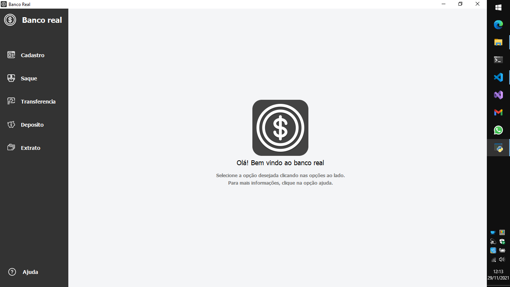
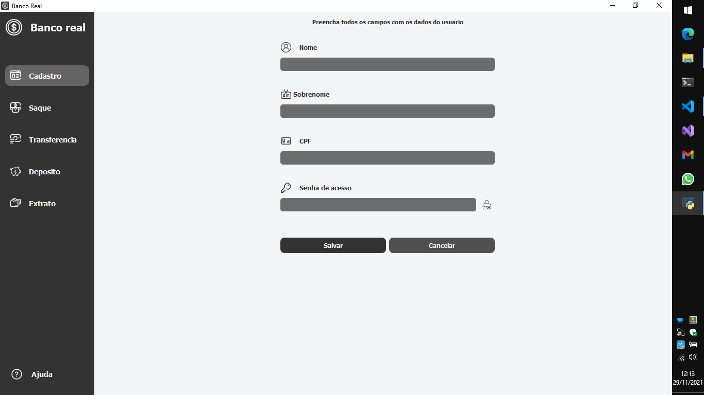
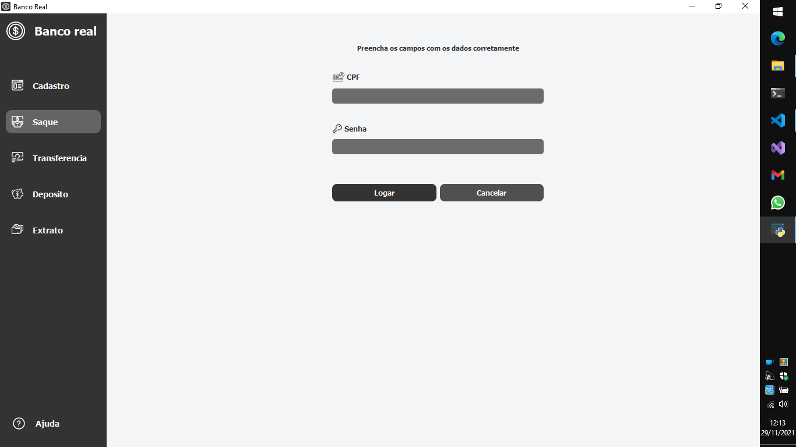

<h1>Banco</h1>

Projeto destinado a uso de varias tecnologias
para simular o funcionamento de um banco real

<h2>Tecnologias e padrões utilizados</h2>
<ul>
    <li>Linguagem de programação <strong>Python</strong></li>
    <li>Orientação a objetos</li>
    <li>Python Type Hints</li>
    <li><strong>Pyqt5</strong> para a interface grafica</li>
    <li><strong>Sockets</strong> para comunicação com o servidor de dados utilizando o modelo cliente/servidor</li>
    <li>Multithreaded Programming no servidor para utilização da aplicação por multi clientes</li>
    <li>Banco de dados relacional <strong>Mysql</strong> para armazenamento de dados</li>

</ul>

<h2>Para rodar o projeto é necessario ter instalado na maquina:</h2>
<ul>
    <li><a href="https://pypi.org/project/PyQt5/" target="_blank">Pyqt5</a></li>
    <li><a href="https://pypi.org/project/mysql-connector-python/" target="_blank">mysql-connector-python</a></li>
    <li><a href="https://pypi.org/project/pyqt5-tools/" target="_blank">pyqt5-tools</a></li>
    
instale todas bibliotecas por meio do pip

</ul>

<h2>Capturas de tela</h2>

